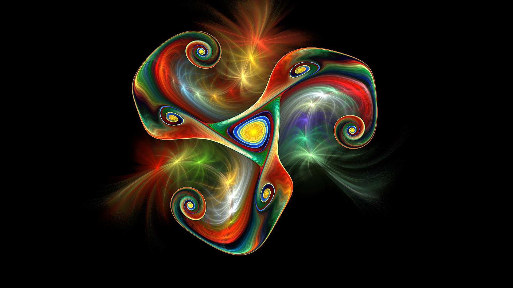

# Genuary 1, 2023
Prompt: Perfect loop / Infinite loop / endless GIFs

I used JWildfire for this. I took a gnarl flame I created a few years ago and added motion curves to animate it, ensuring that the first and last frames are the same so it will loop.

JWildfire parameters in gen1.flame. Video in gen1.mp4. Here is the first frame (the original gnarl flame):

Tags: #genuary #genuary2023 #genuary1 #jwildfire
