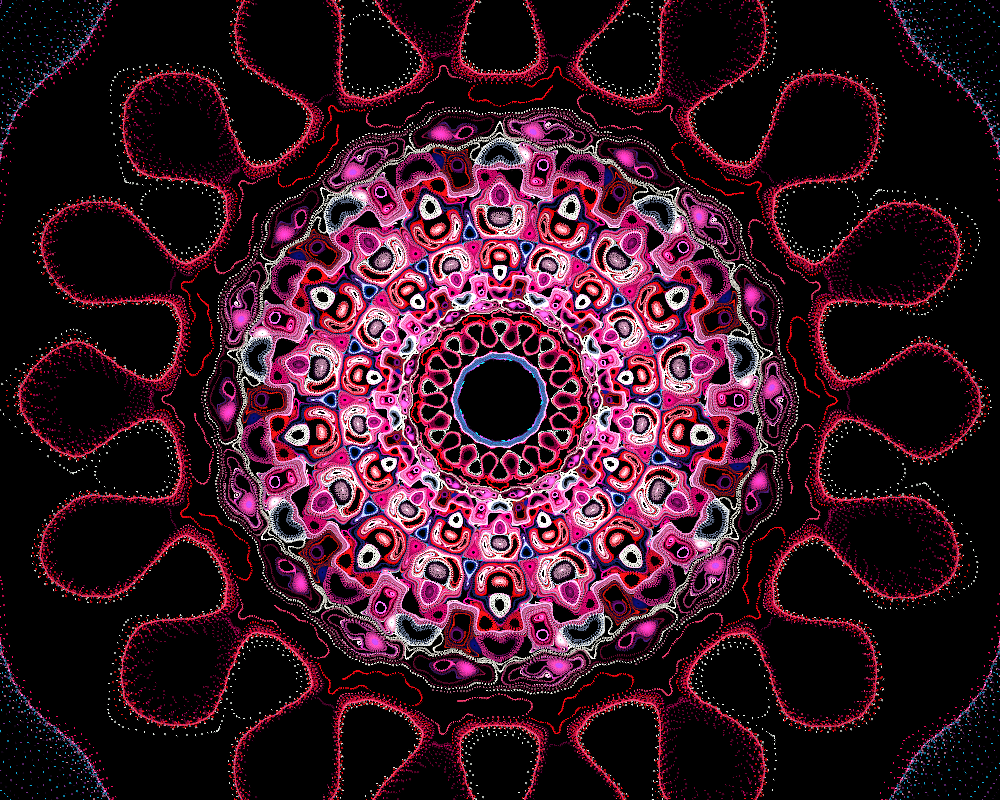

# Genuary 3, 2023
Prompt: Glitch Art

I took some liberty with this prompt; instead of doing art with errors, I used the glitch fractal flame style first described by Jessica Darling (aka FarDareisMai). Most flames are attractors, so repeatedly iterating any random initial point will produce the same flame. Glitch flames are not; the orbits of two different initial points may each contain hundreds of unique points, but have no common points. This gives them a unique appearance, but also makes them difficult to work with.

Jessica used Apophysis, but it is somewhat easier to do in JWildfire. I wrote an article on the topic myself. In particular, I wrote a JWildfire variation *pre_stabilize* which helps make glitch flames reproducible.

Here is my result for today:

I made some others too:

Flame files are included.

Links:
[Jessica's original post](https://www.deviantart.com/fardareismai/journal/What-is-Glitch-Style-392968745)  
[My Glitch Flames article](https://fractalformulas.wordpress.com/2018/02/21/glitch-flames/)  

Tags: #genuary #genuary2023 #genuary3 #jwildfire