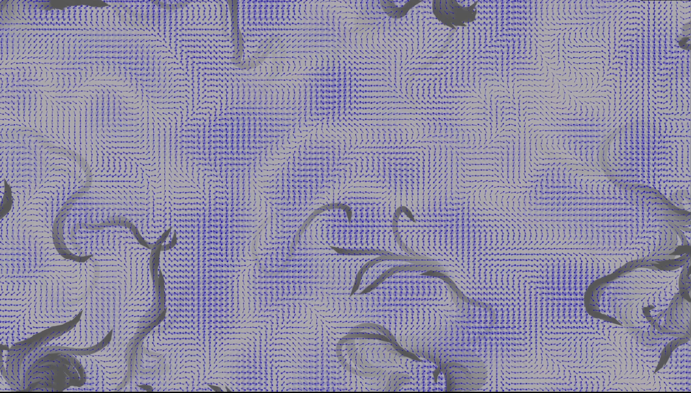

# Genuary 5, 2023
Prompt: Debug view

Last year, I studied *The Nature of Code* by Daniel Shiffman, implementing the examples and exercises in Rust using the Nannou creative coding library. My goal was mostly to learn Rust and Nannou better, but I learned a lot of useful principles from the text. One of the topics in chapter 6 on autonomous systems was making "vehicles" follow a Perlin noise based flow field. My take on exercise 6.7, using a changing flow field, is this program.

The debug view shows the flow field using blue arrows. I also added a "trails" feature, where I only partially erase the screen each frame, so each vehicle leaves a trail. The trails feature in the debug view is especially interesting; the parts of the flow field that are changing become darker, so the Perlin noise basis is clearly visible.

A video is included in this directory along with the Rust source code. If you have Rust installed, copy the files to your computer, change to the directory, and type `cargo run --release` to run it. Press 'D' to toggle debug mode and 'T' to toggle the trails feature.

Links:
[Nature of Code](https://natureofcode.com/)
[Nannou framework](https://nannou.cc/)

Tags: #genuary #genuary2023 #genuary5 #jwildfire