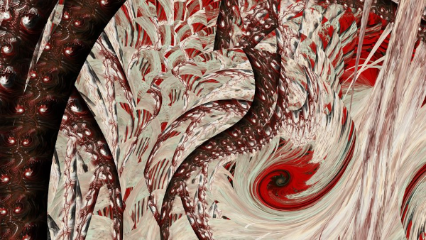

# Genuary 6, 2023
Prompt: Steal Like An Artist

I've been making fractal art for over ten years now. One of the common practices is for artists to share the parameters they used to make pieces so that others can learn from them and use them as the basis for their own works. That's what today's prompt means to me.

I stole some JWildfire parameters generously shared by my buddy Brad Stefanov and reworked them to make today's piece:

His original fractal has a fairly complicated structure for a flame fractal: three transforms linked to a fourth that is then linked to a fifth. Don't worry if that doesn't mean anything to you! It's just a description of the magic that made this, which he titled [*ChocoCherryCream Swirl*](https://www.deviantart.com/snicker02/art/ChocoCherryCream-Swirl-943576287):

I kept the same structure for mine, though my result is much more chaotic!

Tags: #genuary #genuary2023 #genuary6 #jwildfire