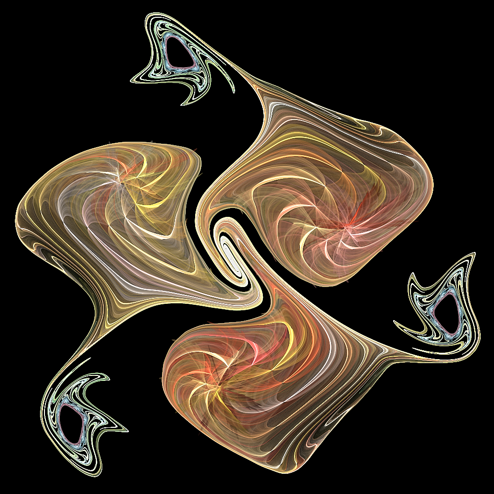

# Genuary 7, 2023
Prompt: Sample a color palette from your favorite movie/album cover

I made a gnarl in JWildfire; params are in the folder. JWildfire has a feature to create a gradient from an image, which made today's prompt easy!

The color palette comes from the cover for the album [*My Eyes Are Wildflowers*](https://jenisagesidwell.bandcamp.com/album/my-eyes-are-wildflowers) by my niece JeniSage Sidwell. I don't remember the artist's name.
