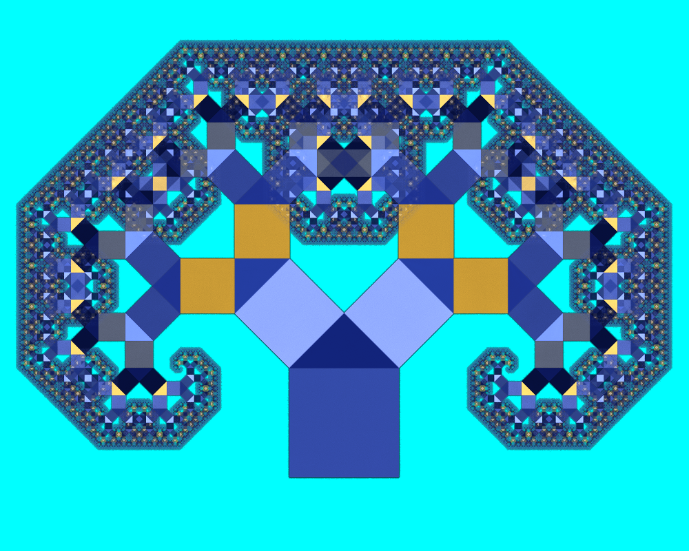

# Genuary 9, 2023
Prompt: Plants

This is a Pythagoras tree, so named because the figure of three squares surrounding a right triangle is used in one proof of the Pythagorean theorem. I made this in JWildfire.

Here is an alternate version, with equal angles.

Parameters for both are in the directory.

Tags: #genuary #genuary2023 #genuary9 #jwildfire
