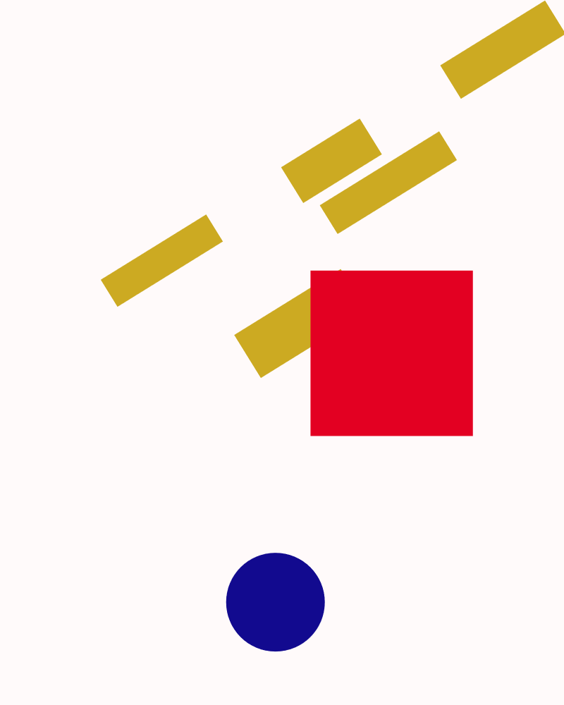

# Genuary 11, 2023
Prompt: Suprematism

Suprematism was created by Kazimir Malevich, who believed it would lead to the "supremacy of pure feeling or perception in the pictorial arts". It is characterized by fundamental geometric forms. One of Malevich's first suprematist paintings was simply a black square on a canvas, and one of his last was a white square on a (white) canvas. Between these, he used more forms and colors to add interest.

I wrote a program using p5.js that draws some random rectangles reminiscent of this form. Then it draws a circle placed to try to add balance to the overall work. Here are a few examples:

  
  

The code is included in this directory, or may be run from the Internet at https://editor.p5js.org/rsidwell/full/tu3_jJZud; click the window, then press space to generate a new piece or 'S' to save the current one.

The code can be viewed at https://editor.p5js.org/rsidwell/sketches/tu3_jJZud.

Tags: #genuary #genuary2023 #genuary11 #p5js
