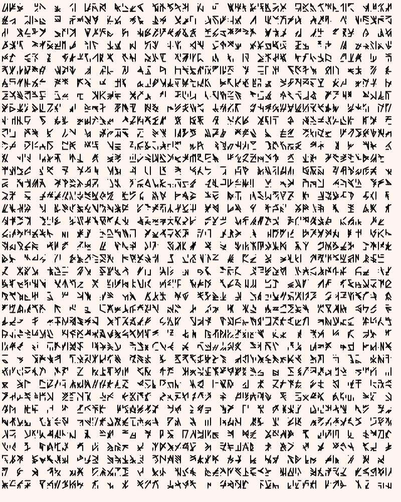

# Genuary 14, 2023
Prompt: Aesemic

I wrote some code using p5.js to generate a sheet of glyphs made by making five random strokes in a 3x4 grid. (I tried different sizes, but like this one best.) I threw in some random spaces to make it look more like a language. 

Here are a few examples:

  
  
  
  

The code is included in this directory, or may be run from the Internet at https://editor.p5js.org/rsidwell/full/aFuDBDaRK; click the window, then press space to generate a new piece or 'S' to save the current one.

The code can be viewed at https://editor.p5js.org/rsidwell/sketches/aFuDBDaRK.

Tags: #genuary #genuary2023 #genuary14 #p5js
