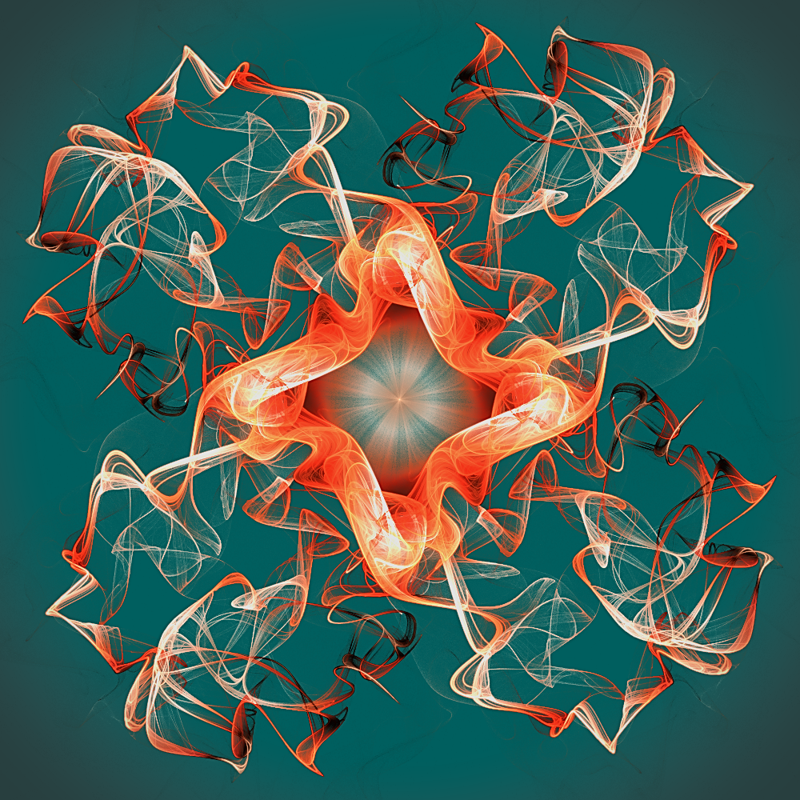

# Genuary 15, 2023
Prompt: Sine waves

I used JWildfire again, but actually wrote some code! I made a custom variation to implement time-discrete phase planes, as described in chapter 14 of *Computers , Pattern, Chaos and Beauty* by Clifford A Pickover. The equation I used is f(x) = sin[x + sin(3x)], so a sine wave modulated by a sine wave.

Tags: #genuary #genuary2023 #genuary15 #jwildfire