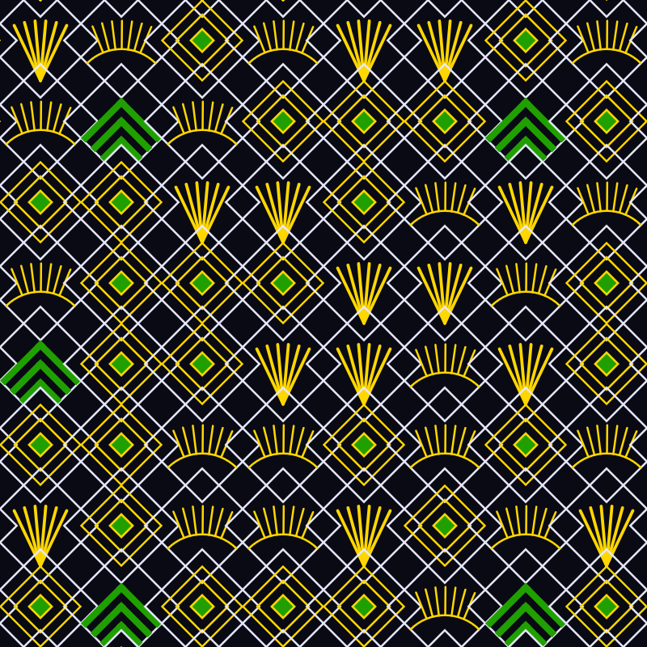
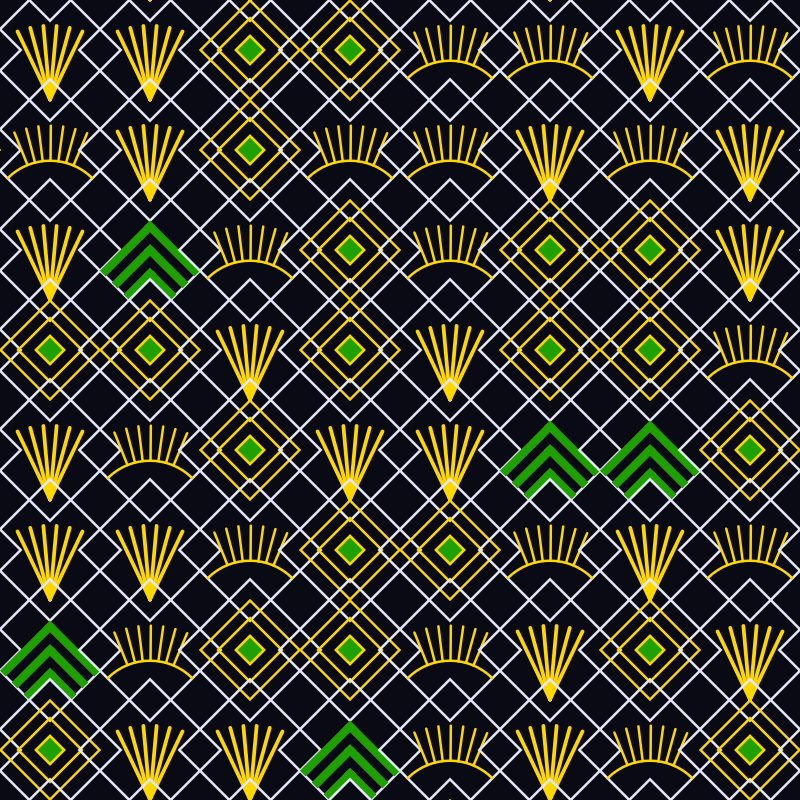

# Genuary 20, 2023
Prompt: Art Deco

I wrote a p5.js program to draw a grid of squares rotated 45 degrees, with a random art deco pattern inside each. 

  
  
  

[Make your own](https://editor.p5js.org/rsidwell/full/e8XMHHcfm)

Tags: #genuary #genuary2023 #genuary20 #p5js