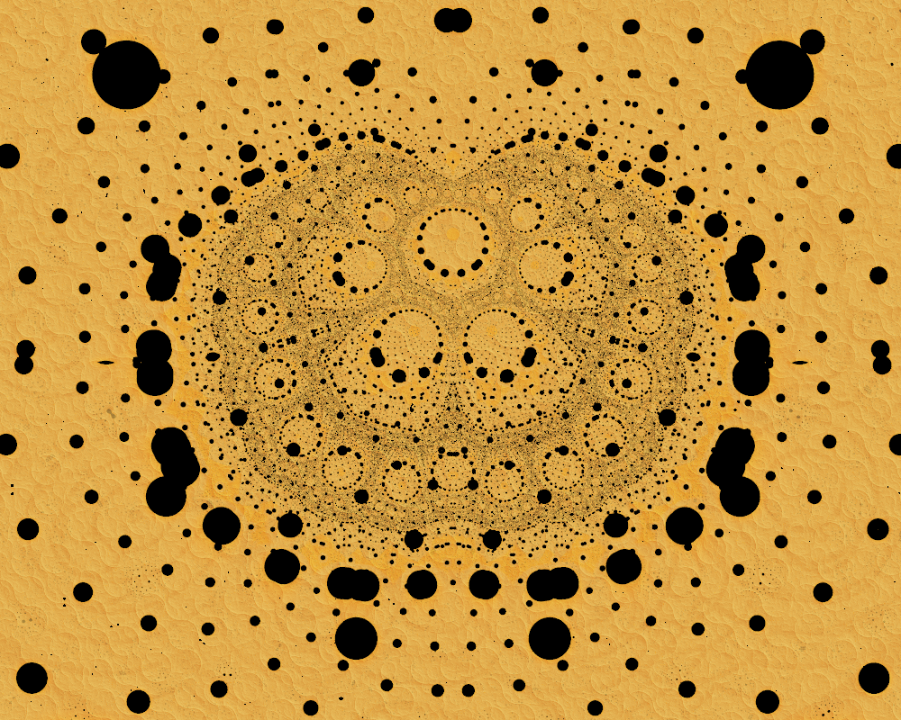

# Genuary 25, 2023
Prompt: Yayoi Kusama

I made this in Ultra Fractal, inspired by Yayoi Kusama's "Dots Infinity".

Tags: #genuary #genuary2023 #genuary25 #ultrafractal

### Outtakes
Another Ultra Fractal piece:

Before I made them, I tried making something based on her "Accumulation of Stamps, 63", which she made by pasting labels on brown paper she covered with a black ink wash. I think I was drawn to it because it reminds me of "Schotter" by George Nees, made about the same time. I just used black paper, and it wasn't as big. And it didn't scan well. I think I need to use a larger paper and give more space between the labels. It also looks like her labels have a black outline, which also helps.

