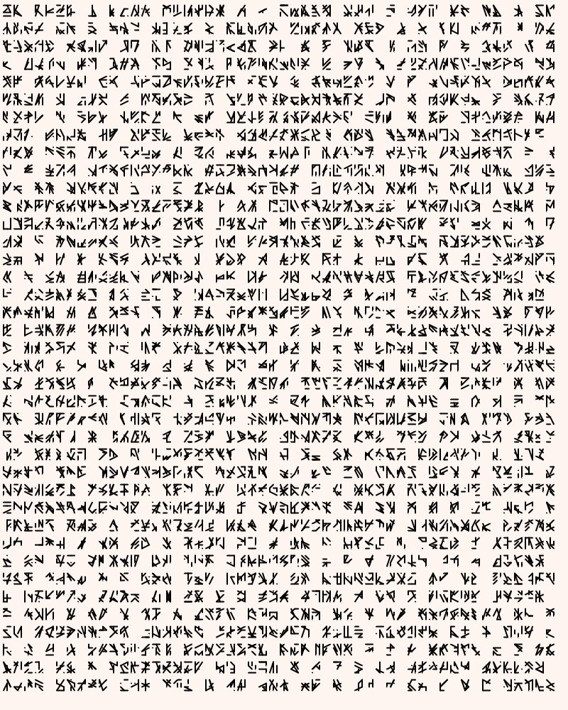
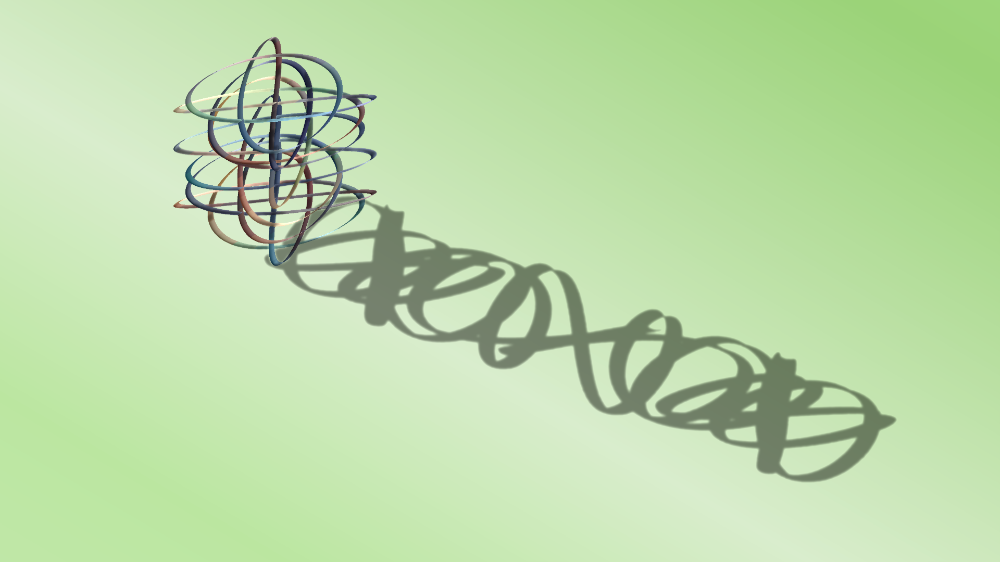

# Genuary2023
My work for Genuary 2023 (see https://genuary.art/). See individual folders for more details on each day.

**1. Perfect loop** (JWildfire)

**2. Made in 10 minutes** (JWildfire)

**3. Glitch Art** (JWildfire)

**4. Intersections** (Marker on paper)

**5. Debug view** (Rust/Nannou)

**6. Steal Like An Artist** (JWildfire)

**7. Sample a color palette from your favorite album cover** (JWildfire)

**8. Signed Distance Functions** (Ultra Fractal)

**9. Plants** (JWildfire)

**10. Generative music** (VCV Rack)

**11. Suprematism** (p5.js)

**12. Tessellation** (JWildfire)

**13. Something you’ve always wanted to learn** (Oil on wood)

**14. Aesemic** (p5.js)

**15. Sine Waves** (JWildfire/Java)

**16. Reflection of a reflection** (JWildfire)

**17. A grid inside a grid inside a grid** (p5.js)

**18. Definitely not a grid** (Acrylic on cardboard)

**19. Black and white** (JWildfire)

**20. Art Deco** (p5.js)

**21. Persian Rug** (Ultra Fractal)

**22. Shadows** (JWildfire)

**23. More Moiré** (p5.js)

**24. Textile** (JWildfire)

**25. Yayoi Kusama** (Ultra Fractal)

**26. My kid could have made that** (Fingerpaint on paper)

**27. In the style of Hilma Af Klint** (JWildfire)

**28. Generative poetry** (JWildfire)

**29. Maximalism** (JWildfire)

